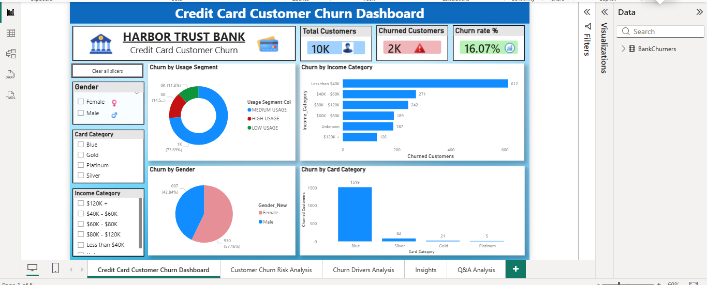
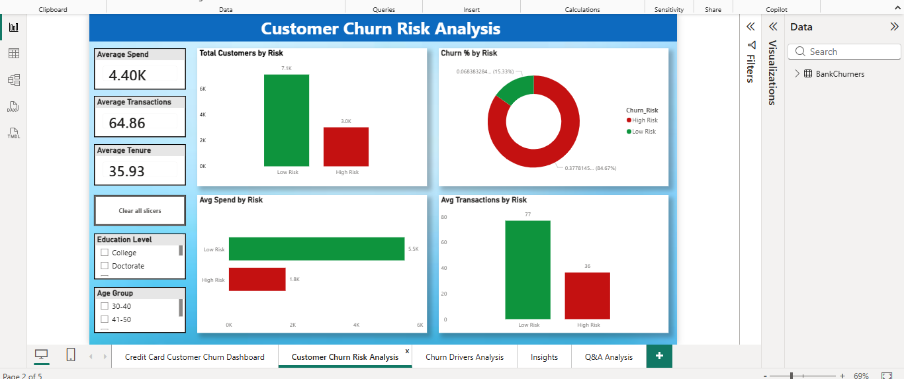
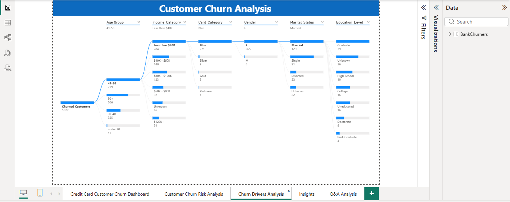

# 💳 Credit Card Customer Churn Analysis

🚀 Built an interactive churn analysis dashboard to identify high-risk customers and improve retention strategies.  

📊 End-to-End Data Analytics Project using **SQL, Excel, and Power BI**

---

## 📌 Overview

This project focuses on analyzing customer churn behavior in a credit card business using **SQL, Excel, and Power BI**.
The objective is to identify key churn drivers, segment customers based on risk, and provide actionable business recommendations.

---

## 🎯 Business Problem

**Customer churn is a major challenge for financial institutions.**

This project aims to:

* Identify high-risk customers
* Understand behavioral patterns leading to churn
* Suggest strategies to improve retention

---

## 🛠️ Tools & Technologies

* **SQL** → Data extraction, transformation, and analysis
* **Excel** → Data preprocessing & cleaning
* **Power BI** → Dashboard creation & visualization

---

## 📂 Dataset

* `BankChurners.csv`
  Contains customer demographics, transaction behavior, credit usage, and churn status.

---

## 📊 Dashboard Pages

### 1️⃣ Customer Churn Dashboard

* Total Customers: **10,000**
* Churned Customers: **2,000**
* Churn Rate: **~16%**

**Analysis by:**

* Gender
* Card Category
* Income Segment
* Usage Behavior

---

### 2️⃣ Customer Churn Risk Analysis

* Segmentation into **High Risk vs Low Risk**

**Metrics analyzed:**

* Average Spend
* Transactions
* Tenure

📉 **High-risk customers show:**

* Lower transactions
* Lower engagement

---

### 3️⃣ Churn Drivers Analysis

**Key factors influencing churn:**

* Age group
* Income category
* Card type
* Education level
* Marital status

---

### 4️⃣ Q&A Dashboard

* Interactive dashboard for business queries
* Enables quick insights using natural language

---

## 🚀 Key Insights & Recommendations

### 🔍 Insights

* Low usage customers have higher churn
* Income < $40K shows higher churn
* Blue card users have highest churn
* Age group 40–60 shows higher churn
* High inactivity leads to churn
* High credit utilization increases churn

---

### 💡 Recommendations

* Offer rewards & cashback for low usage users
* Provide flexible plans for low-income customers
* Improve customer support & engagement
* Target inactive users with campaigns
* Personalize offers based on behavior

---

## 🧠 SQL Analysis

**Key SQL operations performed:**

* Churn rate calculation
* Customer segmentation
* Missing value analysis
* Aggregations by:

  * Card category
  * Age group
  * Usage segment
  * Inactivity period

---

## 🚀 Key Outcomes

* Identified major churn drivers
* Segmented customers based on risk
* Built interactive dashboards for business decisions
* Provided data-driven recommendations

---

## 📌 Conclusion

This project demonstrates how data analytics can be used to:

* Predict customer behavior
* Reduce churn
* Improve customer retention strategies

---

## 👨‍💻 Author

**Siva Sai Gopal Mandru**  
Data Analyst (Fresher)

---

## 🔗 GitHub Repository

👉 [View Project](https://github.com/sivasaigopalm3777/Credit-Card-Churn-Analysis)

---

## 💬 Feedback

Feel free to share your feedback and suggestions!

⭐ If you like this project, don’t forget to star the repo!
